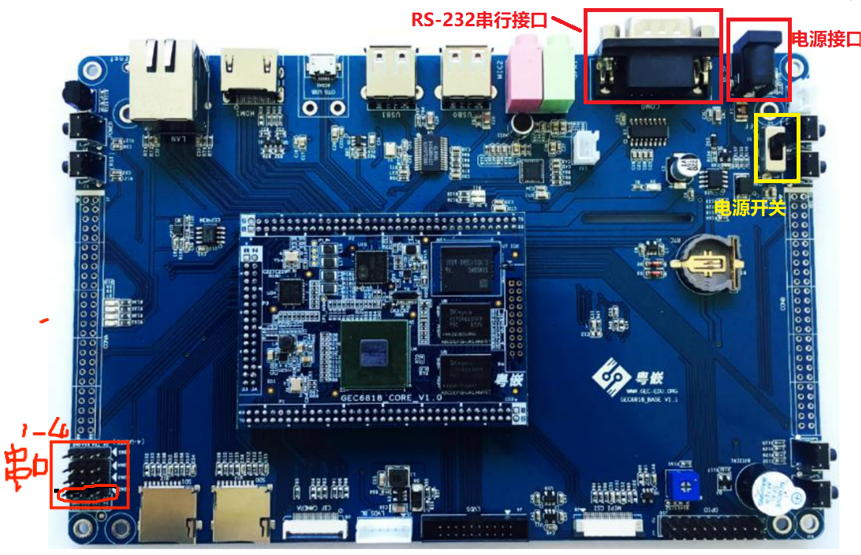
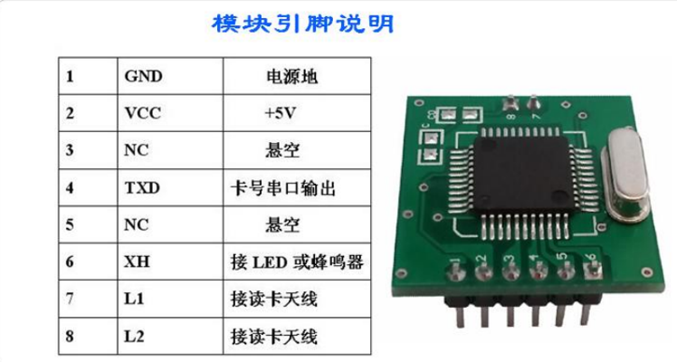
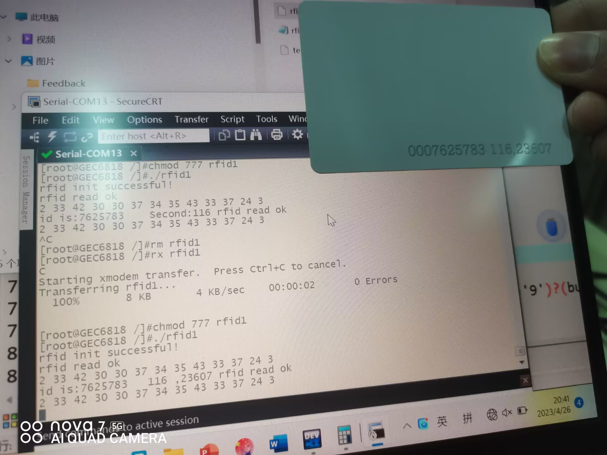

## 实验一：RFID标签读取实验

### 一、 实验目的

**掌握RFID射频识别系统上层应用开发。**

**获取RFID卡片上的卡号**

### 二、实验所需器材

**1.电脑 1台**

**2.GEC6818板子一块**

**3.低频RFID模块**

### 三、RFID模块图及接线

**接线**

| 模块 | GEC6818的串口1 |
| :--: | :------------: |
|  1   |      GND       |
|  2   |      VCC       |
|  4   |      RXD       |
| 其他 |     可不接     |

### 四、代码

**位于RFID_GEC6818文件夹下**

### 五、实验现象

### 六、总结

**在本次实验中收获了很多关于RFID模块相关操作，同时在实验过程中遇到一些问题及失误。首先是关于C语言的问题，变量为初始化即使用，导致错误结果（低级错误），其次是波特率设置错误，导致无法获取卡号。**

